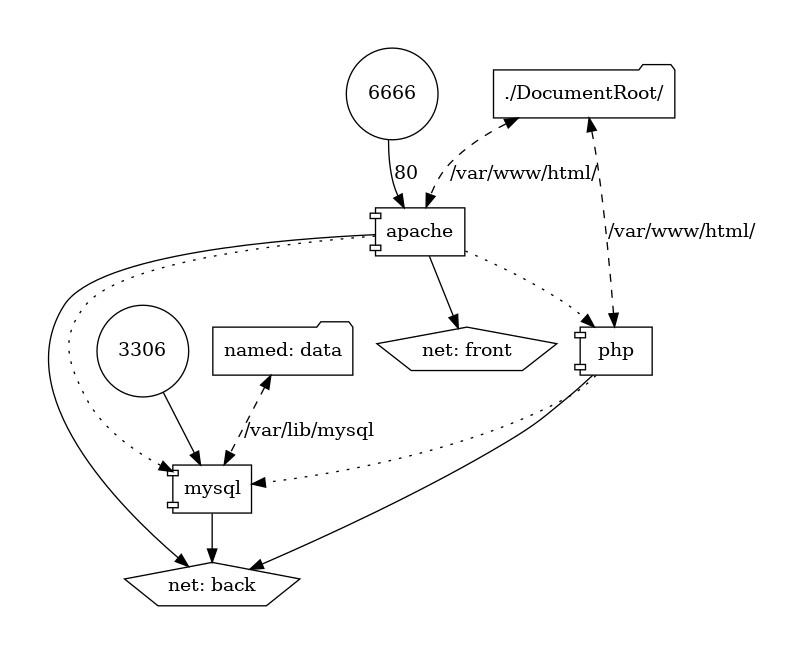

# Dockerized LAMP (Apache + PHP-FPM + MySQL)

This repo contains simple LAMP setup, consisting of separate MySQL, Apache and PHP-FPM containes, built from Dockerfiles.

In [`DocumentRoot/index.php`](./DocumentRoot/index.php) you can find simple index.php which will print PHP info and connect to MySQL database using credentials specified in [`docker-compose.yml`](./docker-compose.yml)

See the [`docker-compose.yml`](./docker-compose.yml) for details.

Containers setup looks like this:


## Building and running the app

Clone this repo and run

```sh
$ docker-compose build
$ docker-compose up
```

to run the application.

Then, go to [`localhost:6666`](localhost:6666) or, if your browser blocks this port, use `curl` or `wget` to read the response

```sh
$ curl localhost:6666 > index.html
```
or
```sh
$ wget localhost:6666
```
and open `index.html` in your browser.

## Stopping the app

Press `Ctrl+C` or use `docker-compose stop`.